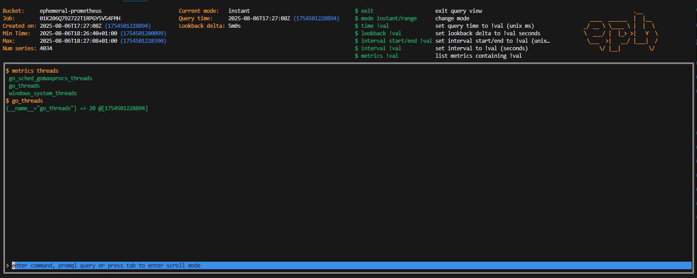

# eph

```
                .__     
  ____  ______  |  |__  
_/ __ \ \____ \ |  |  \ 
\  ___/ |  |_> >|   Y  \
 \___  >|   __/ |___|  /
     \/ |__|         \/ 

  ephemeral prometheus     
```




## Run PromQL queries without a Prometheus instance.

**eph** is a CLI tool that lets you load metrics from a file/R2 and run [PromQL](https://prometheus.io/docs/prometheus/latest/querying/basics/) queries against them — no Prometheus server required.

It pairs with an **ingester** that supports pull-based metric ingestion, uploading them to an S3-compatible blob storage in a format the CLI can understand.

---
## Motivation
If you are generating metrics from self-contained, ephemeral workloads, you might want to store those in blob storage rather than your 'main' prometheus / mimir backend, to avoid cluttering. 

This tool allows you to run queries on those files.

## Supported formats

Currently, Prometheus text format **with timestamps** is supported. 

Example:
```
# HELP go_gc_cycles_automatic_gc_cycles_total Count of completed GC cycles generated by the Go runtime. Sourced from /gc/cycles/automatic:gc-cycles.
# TYPE go_gc_cycles_automatic_gc_cycles_total counter
go_gc_cycles_automatic_gc_cycles_total 209 1754154517000
# HELP go_gc_cycles_automatic_gc_cycles_total Count of completed GC cycles generated by the Go runtime. Sourced from /gc/cycles/automatic:gc-cycles.
# TYPE go_gc_cycles_automatic_gc_cycles_total counter
go_gc_cycles_automatic_gc_cycles_total 20900 1754154517001
```

Although the Prometheus parser complains about having duplicate comments, the CLI strips comments before processing. The reason for this is so we can have a single file with several scrapes (append to file instead of making new one).


## How it works
The **ingester** can be configured:
 - **to scrape** a target serving Prometheus text exposition format (the usual /metrics). It will append the current timestamp if not present, and append it to the current job's file. When the **job finishes** it will upload the file to the configured destination.

The **cli**:
 - fetches a list of files in a given S3 bucket
 - opens an interactive session with a given file where you can run PromQL queries


## Future work

Store data in remote_write format (smaller, faster to ingest).
A daemon that can be configured as a Grafana datasource that fetches metrics from file ondemand for a specific job, and executes queries on it.
Run inside a cloudflare worker (both ingester and querier).

## Installation

```bash
git clone https://github.com/yourusername/ephemeral-prometheus.git
cd ephemeral-prometheus
go run . querier --query go_gc_gogc_percent --time 1754335979103 --keyId $ACCESS_KEY_ID --secretKey $SECRET_ACCESS_KEY --endpoint $R2_BUCKET_ENDPOINT --bucket $R2_BUCKET_NAME
